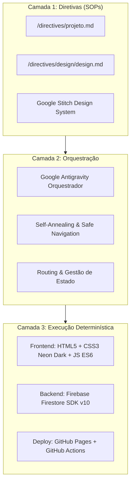

# 🏗️ Arquitetura do Sistema - BurguerSync Ourinhos

## 📐 Visão Geral (Antigravity 3-Layer Architecture)

---

## 🗄️ Esquema do Banco de Dados NoSQL (Firebase Firestore)

### Coleção: `pedidos`

| Campo | Tipo | Descrição | Exemplo |
| :--- | :--- | :--- | :--- |
| `cliente.nome` | String | Nome completo do cliente | "Lucas Ferreira" |
| `cliente.celular` | String | Telefone / WhatsApp de contato | "(14) 99876-5432" |
| `cliente.endereco` | String | Endereço de entrega | "Rua Paraná, 450 - Centro" |
| `cliente.obsEntrega` | String | Observações e referências | "Interfone 42" |
| `itens` | Array<Object> | Lista de produtos selecionados | `[{ nome: "...", preco: 28.00, quantidade: 2 }]` |
| `pagamento.metodo` | String | Forma de pagamento | "Pix", "Cartao_Entrega", "Dinheiro_Entrega" |
| `pagamento.troco` | String/Null | Troco solicitado em dinheiro | "R$ 50,00" ou `null` |
| `valores.subtotal` | Number | Soma dos itens | 56.00 |
| `valores.taxaEntrega` | Number | Taxa fixa de entrega | 5.00 |
| `valores.total` | Number | Valor final a pagar | 61.00 |
| `status` | String | Estado do pedido no Kanban | "Recebido", "Em Preparo", "Saiu para Entrega", "Entregue" |
| `horario` | Timestamp | Timestamp gerado pelo servidor | `serverTimestamp()` |

---

## 🔄 Fluxo de Atualização em Tempo Real

1. **Cliente:** Monta o carrinho na vitrine e clica em **Finalizar e Enviar Pedido**.
2. **Gravação:** Função `addDoc` persiste o documento na coleção `pedidos` do Firestore.
3. **Escuta Realtime:** O painel da cozinha, conectado via `onSnapshot(query(collection, orderBy("horario", "desc")))`, detecta a inserção instantaneamente sem necessidade de refresh (F5).
4. **Operação Kanban:** A equipe da cozinha clica em **Iniciar Preparo ➔**, disparando `updateDoc({ status: "Em Preparo" })`, movendo o card entre as colunas instantaneamente.
